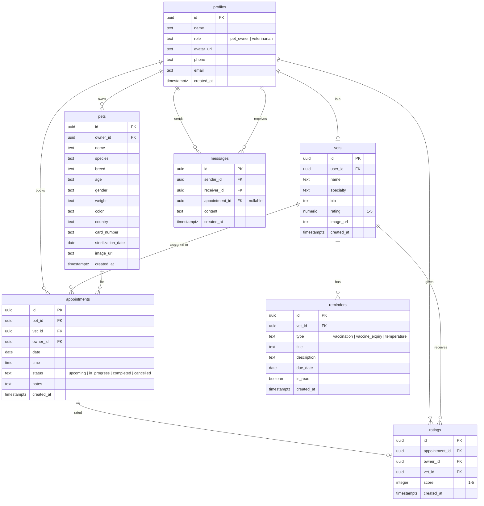

# 🐾 Paws & Prognosis

A veterinary clinic appointment and care management mobile app built with React Native (Expo) and Supabase.

---

## About

Paws & Prognosis connects pet owners with veterinarians for appointment scheduling, pet health management, and real-time communication.

**User Roles:**
- **Pet Owner** — browse vets, book appointments, manage pets, view calendar, chat with vets, rate visits
- **Veterinarian** — manage appointments, view patient cases, communicate with pet owners, track reminders

---

## Tech Stack

| Layer | Technology |
|-------|-----------|
| Framework | React Native + Expo SDK 54 |
| Language | TypeScript (strict) |
| Styling | NativeWind v4 (Tailwind CSS for RN) |
| Navigation | React Navigation 6 (native-stack + bottom-tabs) |
| Backend | Supabase (PostgreSQL, Auth, Realtime, Storage) |
| Forms | react-hook-form + zod |
| Calendar | react-native-calendars |
| Camera | expo-image-picker |
| Icons | @expo/vector-icons (Ionicons) |
| Blur Effects | expo-blur |
| Animations | react-native-reanimated |

---

## Getting Started

### Prerequisites

- Node.js 18+
- Expo Go app on your phone (SDK 54)
- Supabase project ([supabase.com](https://supabase.com))

### Installation

```bash
git clone https://github.com/kxnn02/Paws-and-Prognosis.git
cd Paws-and-Prognosis
npm install
cp .env.example .env
# Fill in your Supabase URL and anon key in .env
```

### Running the App

```bash
npx expo start           # Start development server
npx expo start --clear   # Start with cleared cache
npx tsc --noEmit         # Type check
```

Scan the QR code with Expo Go on your phone. Phone and laptop must be on the same network.

---

## Project Structure

```
src/
├── navigation/        # Stack and tab navigators (Auth, Owner, Vet)
├── screens/
│   ├── auth/          # Login, SignUp, ForgotPassword, Splash
│   ├── owner/         # Home, VetDetails, Booking, Calendar, MyPets, AddPet,
│   │                  # EditPet, PetProfile, ChatList, Profile, Rating, Tips, Reschedule
│   ├── vet/           # Dashboard, Appointments, ChatList, Account
│   └── shared/        # SharedChatConversation, EditProfile
├── components/        # Reusable UI (Button, Card, VetCard, SearchBar, Avatar, etc.)
├── hooks/             # Custom hooks (usePets, useAppointments, useChat, useVets, etc.)
├── lib/               # Supabase client, schemas, constants, helpers, formatters
├── context/           # AuthContext
├── types/             # TypeScript interfaces
└── __tests__/         # Unit tests (formatters, notesHelper)
```

---

## Database Schema



All tables use **Row Level Security (RLS)** — users can only access their own data.

---

## Environment Variables

Create a `.env` file in the project root:

```
EXPO_PUBLIC_SUPABASE_URL=https://your-project.supabase.co
EXPO_PUBLIC_SUPABASE_ANON_KEY=your-anon-key-here
```

> ⚠️ Never commit `.env` — it's in `.gitignore`.

---

## Features

### Pet Owner
- Browse and search vets by specialty
- Book appointments with 14-day date picker and time slots
- Manage pets (add/edit/delete with photo upload)
- Calendar view of all appointments
- Real-time chat with veterinarians
- Rate completed appointments
- Reschedule or cancel bookings
- Pet care tips

### Veterinarian
- Dashboard with stats, today's cases, reminders
- Appointment management with status updates
- Real-time chat with pet owners
- Profile and account management

### Security
- Row Level Security on all tables
- Email/password authentication with confirmation
- Sender verification prevents message impersonation
- Input validation with zod schemas
- No secrets in code (env vars only)

---

## Scripts

| Command | Description |
|---------|-------------|
| `npm start` | Start Expo dev server |
| `npm run typecheck` | Run TypeScript compiler check |
| `npm run lint` | Run ESLint |
| `npm test` | Run unit tests |

---

## Design System

Defined in `tailwind.config.js`:

| Token | Value | Usage |
|-------|-------|-------|
| Primary | `#71924F` | CTAs, active states |
| Accent | `#7BBD38` | Bright green accents |
| Background | `#FEF9F4` | Warm beige |
| Heading | `#544864` | Dark purple headings |
| Body | `#343434` | Body text |
| Input BG | `#F5F5F5` | Form fields |
| Placeholder | `#AA865D` | Input placeholders |

---

## Git Workflow

GitHub Flow with protected `main` branch:

```bash
git checkout -b feature/my-feature    # Create branch
git commit -m "feat(scope): description"  # Conventional commits
git push -u origin feature/my-feature     # Push and open PR
```

See [TEAM-SETUP-GUIDE.md](./TEAM-SETUP-GUIDE.md) for full workflow details.

---

## Test Accounts

See [TEST-ACCOUNTS.md](./TEST-ACCOUNTS.md) for working login credentials (vet and pet owner accounts).

---

## Team

See [TEAM-SETUP-GUIDE.md](./TEAM-SETUP-GUIDE.md) for setup instructions and team workflow.

---

## License

See [LICENSE](./LICENSE) for details.
